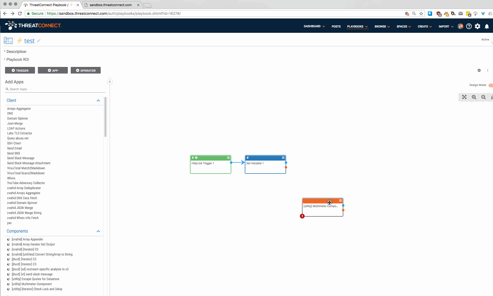

# Playbook Multimeter

Spaces app and playbook component to view data across multiple playbooks. This gives you one place to view any data from different points taken from multiple playbooks.

## Installation

There are two parts to this system:

1. A playbook multimeter component
2. A spaces app

### Playbook Multimeter Component

The spaces app is in the `playbook_component/` directory of this repository (it is called `[utility] Multimeter Component.pbx`). You can download it and import it into your instance.

### Spaces App

The spaces app is in the `spaces_app/` directory of this repository. The `README.md` file in that directory has instructions for packaging and installing the app.

Enjoy!
